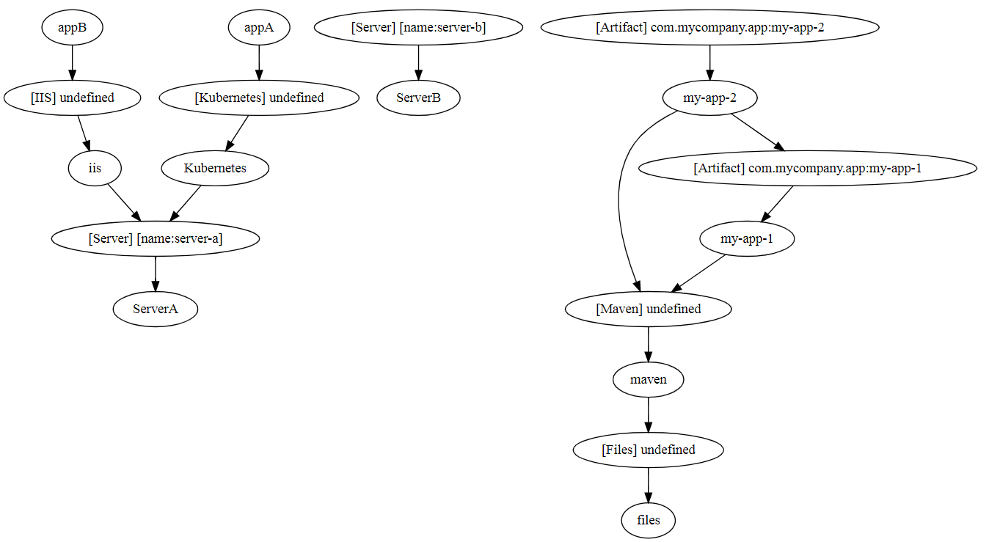

# INV - Intertwined network valuables

***INV*** is a tool facilitate an *environment as code* solution in your technological ecosystem. 
It enables such feature by ***sequencing intertwined network valuables***. These valuables can be your databases, your apps, your webservices, your servers, etc.  
Basically, **anything** collaborating within your ecosystem.

## How to get?

Get latest version here : [Version 0.5-beta](https://github.com/peasoupio/inv/releases/download/0.5-beta/inv-0.5-beta-SNAPSHOT.zip)  


[](https://sonarcloud.io/dashboard?id=inv)

#### Maven coordinates:

```
<dependency>
    <groupId>io.peasoup</groupId>
    <artifactId>inv</artifactId>
    <version>0.5-beta-SNAPSHOT</version>
</dependency>
```
(NOTE : Snapshots need to be downloaded from this repository: https://oss.sonatype.org/content/repositories/snapshots/) 

#### Prerequisites  
JDK 8 or higher

## Avaiable commands:  
```
Inv.

Usage:
  inv load [-x] [-e <label>] <pattern>...
  inv scm [-x] <scmFiles>...
  inv delta <base> <other>
  inv graph (plain|dot) <base>
  inv web [-x]
  
Options:
  load         Load and execute INV files.
  scm          Load and execute SCM files.
  delta        Generate delta between two run files.
  graph        Generate a graph representation.
  web          Start the web interface.
  -x --debug   Debug out. Excellent for troubleshooting.
  -e --exclude Exclude files from loading.
  -h --help    Show this screen.
  
Parameters:
  <label>      Label not to be included in the loaded file path
  <pattern>    An Ant-compatible file pattern
               (p.e *.groovy, ./**/*.groovy, ...)
               Also, it is expandable using a space-separator
               (p.e myfile1.groovy myfile2.groovy)
  <scmFiles>   The SCM file location
  <base>       Base file location
  <other>      Other file location
  plain        No specific output structure
  dot          Graph Description Language (DOT) output structure 
```

## Quick example:

Let's build a quick and simple example even your boss will understand.  
INV requires a good understanding of your **existing** ecosystem rules.  
Our objective is to **convert these rules** into ***Groovy script files*** and let INV handle the rest for us.

### First step: What are our ecosystem rules?
* ServerA hosts AppA through Kubernetes
* ServerB hosts AppB through IIS

With these rules, we can determine:  
* 6 *INV*'s
* ***At least*** 4 statements (or link or broadcasts/requirements) 

### Second step: How do we write it up in *Groovy* using *INV*?

*Groovy* is the most-suitable framework for understandable, idiomatic and quick-time to market solutions.  
*INV* adds a layer using the DSL features of *Groovy*.     
For more information about the syntax of *INV*, [read this](https://github.com/peasoupio/inv/wiki/Syntax).

##### Hint:
Think of your *INV*'s as individuals that are working together in a production chain.  
Ask yourself "who does what" and "who tells what".  

Bellow is a *rendering* of our previous example statements:   

###### serverA.groovy
```groovy
inv {
    name "ServerA"

    broadcast inv.Server using {
        id name: "server-a"
        ready {
            return [
                    host: "10.22.99.999",
                    install: { service ->
                        println "Installing service ${service} on 10.22.99.999"
                    }
            ]
        }
    }
}
```

###### serverB.groovy 
```groovy
inv {
    name "ServerB"

    broadcast inv.Server using {
        id name: "server-b"
        ready {
            return [
                    host: "10.22.99.998",
            ]
        }
    }
}
```

###### kubernetes.groovy 
```groovy
inv {
    name "Kubernetes"

    require inv.Server using {
        id name: "server-a"

        resolved {
            assert response

            response.install("kubectl")
        }
    }

    broadcast inv.Kubernetes using {
        ready {
            return [
                    http      : "http://my-kubernetes.my.host.com",
                    port      : "8089", // not by default
                    installPod: { pod ->
                        println "Pod ${pod} has been installed"
                    }
            ]
        }
    }
}
```

###### appA.groovy
```groovy
inv {
    name "appA"

    require inv.Kubernetes using {
        resolved {
            response.installPod("my-mod-for-app-3")
        }
    }
}
```

###### iis.groovy
```groovy
inv {
    name "iis"

    require inv.Server(name: "server-a")

    broadcast inv.IIS using {
        ready {
            return [
                    deploy: {webApp ->
                        println "IIS webapp ${webApp} has been deployed"
                    }
            ]
        }
    }
}
```

###### appB.groovy
```groovy
inv {
    name "appB"

    require inv.IIS using {
        resolved {
            response.deploy("my-web-app")
        }
    }
}
```

##### Important note: 
*INV* enable a more encapsulated ecosystem.  
 In this simple case, we managed to implement a solution who protects critical information.  
 In our case, ```appB``` does not know which credentials or which host is used to deploy. Only ```ÌIS``` knows.

#### Default implementations:
*INV* comes with default implementations, such as "files (I/O), http, ..."  
It serves mostly as concrete examples on how you could implement things, but you could use them in your ecosystem as well.  
You can see them at [here](./defaults)

### Third step: How to run?

You may use the **command-line** utility (see at the top for available commands).  
You may also use the Web Platform named **INV Composer** for a more elegant and accompanied path.  
 
Here's our example using the command-line utility:   
```
inv load ./example/githubHomepage/*.groov
```  

This command would generate the following output:   
```
[INV] file: ./example/githubHomepage/appA.groovy
[INV] file: ./example/githubHomepage/appB.groovy
[INV] file: ./example/githubHomepage/iis.groovy
[INV] file: ./example/githubHomepage/kubernetes.groovy
[INV] file: ./example/githubHomepage/serverA.groovy
[INV] file: ./example/githubHomepage/serverB.groovy
[INV] ---- [DIGEST] started ----
[INV] ---- [DIGEST] #1 (state=RUNNING) ----
[INV] [ServerA] => [BROADCAST] [Server] [name:server-a]
[INV] [ServerB] => [BROADCAST] [Server] [name:server-b]
[INV] ---- [DIGEST] #2 (state=RUNNING) ----
[INV] [iis] => [REQUIRE] [Server] [name:server-a]
[INV] [iis] => [BROADCAST] [IIS] undefined
[INV] [Kubernetes] => [REQUIRE] [Server] [name:server-a]
[INV] [Kubernetes] => [BROADCAST] [Kubernetes] undefined
Installing service kubectl on 10.22.99.999
[INV] ---- [DIGEST] #3 (state=RUNNING) ----
[INV] [appA] => [REQUIRE] [Kubernetes] undefined
[INV] [appB] => [REQUIRE] [IIS] undefined
Pod my-mod-for-app-3 has been installed
IIS webapp my-web-app has been deployed
[INV] ---- [DIGEST] completed ----
```

By reading the output log, without having the fine details, we can determine:
* Who needs what
* Who says (or give) what
* More precisely, in our case, which instance server (barebone or under kubernetes) hosts AppA and etc.

### Graphs

*INV* output logs are human and "machine" readable.  
In fact, you could also generate a graph from a previous execution.  
NOTE: Output logs does not need to have exclusively *INV* messages, you may output messages to ease troubleshooting. *INV* only looks for lines starting with "[INV]".  

So, continuing with out example, with our last execution (just above), using this command :

    inv graph dot myprevious.log

Upon completion, we get a dot rendered output (see https://en.wikipedia.org/wiki/DOT_(graph_description_language))

```
strict digraph G {
  1 [ label="ServerA" ];
  2 [ label="[Server] [name:server-a]" ];
  3 [ label="ServerB" ];
  4 [ label="[Server] [name:server-b]" ];
  5 [ label="iis" ];
  6 [ label="[IIS] undefined" ];
  7 [ label="Kubernetes" ];
  8 [ label="[Kubernetes] undefined" ];
  9 [ label="appA" ];
  10 [ label="appB" ];
  11 [ label="files" ];
  12 [ label="[Files] undefined" ];
  13 [ label="maven" ];
  14 [ label="[Maven] undefined" ];
  15 [ label="my-app-1" ];
  16 [ label="my-app-2" ];
  17 [ label="[Artifact] com.mycompany.app:my-app-1" ];
  18 [ label="[Artifact] com.mycompany.app:my-app-2" ];
  2 -> 1;
  4 -> 3;
  5 -> 2;
  6 -> 5;
  7 -> 2;
  8 -> 7;
  9 -> 8;
  10 -> 6;
  12 -> 11;
  13 -> 12;
  14 -> 13;
  15 -> 14;
  16 -> 14;
  17 -> 15;
  18 -> 16;
  16 -> 17;
}
```

Using a visual DOT renderer, we get this  image represention of the dot output :  



## What about using an SCM with *INV*?

Yep, we thought about it.  
*INV* is supporting **every** SCM which is accessible programmatically. This includes: ```cvs, svn, tfs, git, Mercurial, ...```  
  
Here is an example using ```git``` to fetch our default implementation ```files```:  
##### mySCMFile.groovy
```groovy
scm {
    name "default-files"
    path "choose your path..."
    scm  "https://github.com/peasoupio/inv.git"
    entry "defaults/files/inv.groovy"
    hooks {
        init {
            "git clone ${scm}" .
        }
        update {
            "git pull"
        }
    }
}
```
NOTE: *INV* toggle automatically from **init** to **update** upon ```path``` existence.

### Contribution
First and only rule: let's work together and have fun :)

### Our friends
#### Java Profiler
Providing a free open-source licence which improve **SIGNIFICANTLY** *INV*'s performances   
[](https://www.ej-technologies.com/products/jprofiler/overview.html)